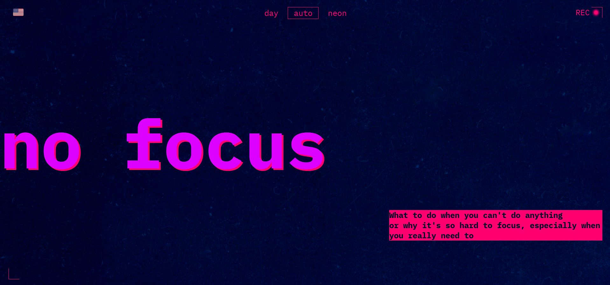
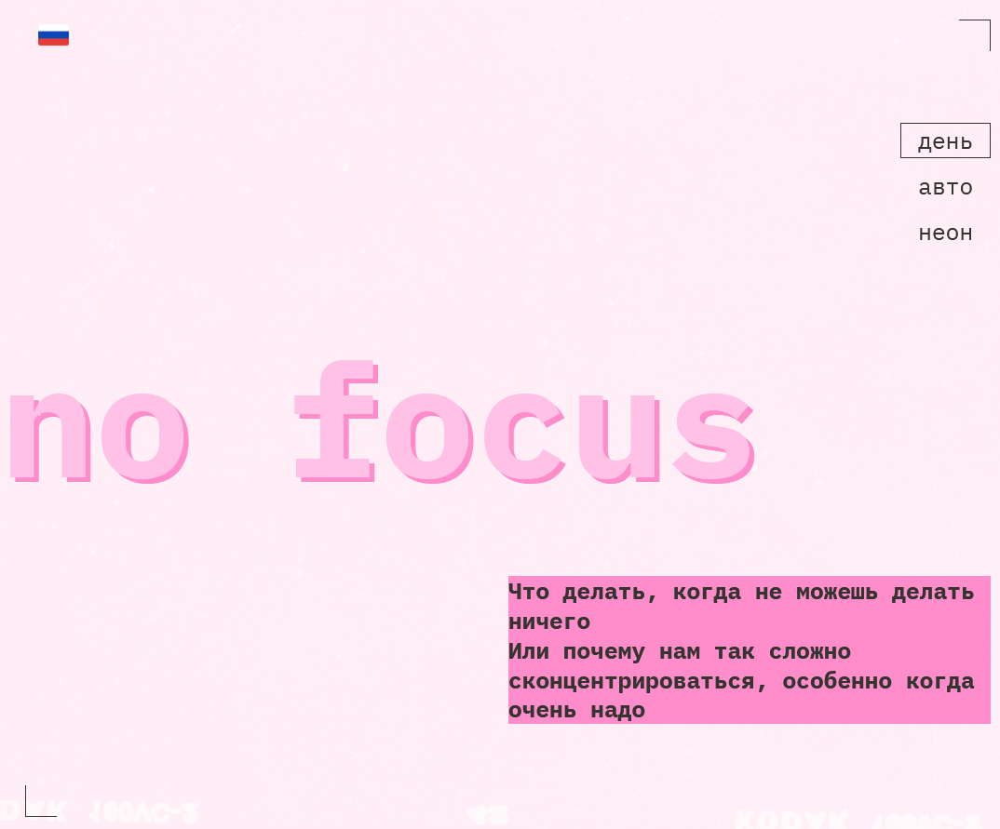
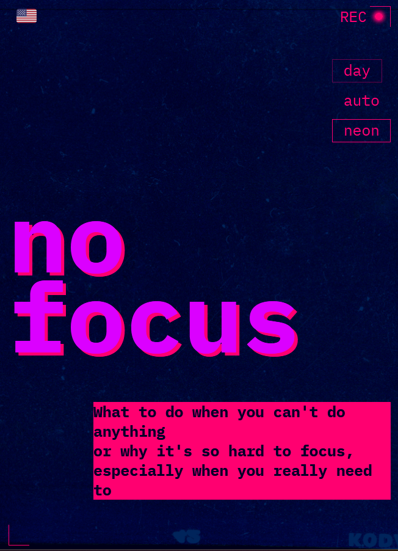

## No Focus - responsive theme-aware bilingual page
**Description:** Third study project in my Frontend Developer course at Yandex.Practicum.  
Sprint 3 – "Layout, responsiveness, and graphics.   
[Demo availible](https://nanferro.github.io/slozhno-sosredotochitsya/) in English and Russian languages.

🔧 Stack: HTML5, CSS3, vanilla JavaScript  
🛠️ Tools: Figma, VS Code, Git, GitHub

**Skills:**
- responsive layout via **mobile-first** approach
- CSS custom properties (:root variables) for theme control
- language switching (EN/RU) using JavaScript
- pixel perfect approach
- media queries for multiple screen sizes

## Screenshots  
  
  
  
